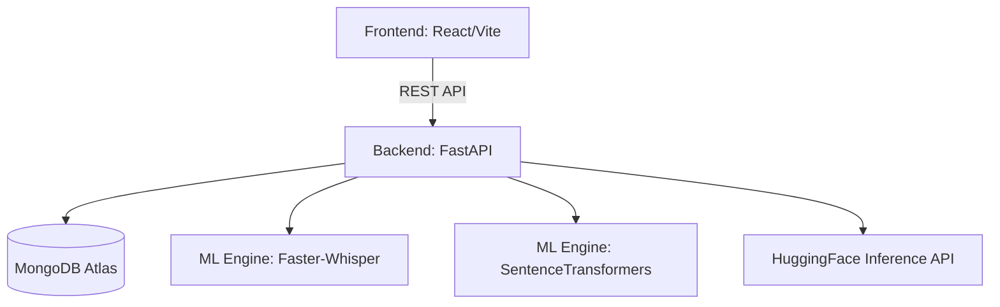

# 🤖 Multimodal AI Interview Simulator

A production-hardened AI interview simulator designed for high reliability and efficiency. Practice real-world interviews with live camera monitoring, high-speed speech recognition, and detailed semantic scoring.

---

## ✨ Features

| Feature | Description |
|---|---|
| 📄 **Resume-Aware** | Parses PDF resumes and generates personalized question plans |
| 🎤 **ASR (Voice)** | Powered by `faster-whisper-tiny` (CPU) or `large-v3-turbo` (GPU) |
| 🧠 **Intelligent Scoring** | `all-MiniLM-L6-v2` semantic overlap + Qwen2.5-72B LLM evaluation |
| 💬 **Filler Detection** | Identifies "um", "uh", "like", and "basically" to improve fluency |
| 🧍 **Posture Analysis** | Real-time skeletal proctoring via MediaPipe BlazePose |
| ⛶ **Anti-Cheat** | Fullscreen lock, tab-switch detection, and violation logging |
| 📊 **Unified Scorecard** | Comprehensive breakdown of skills, readiness, and suggestions |
| 🤖 **Durable State** | MongoDB-backed state machine prevents session loss on refresh |

---

## 🚀 Quick Start (Local)

### 1. Backend Setup
```bash
# Create and activate virtual environment
python -m venv venv
source venv/Scripts/activate  # On Linux: source venv/bin/activate

# Install dependencies
pip install -r requirements.txt

# Start the server
uvicorn backend.app.main:app --host 0.0.0.0 --port 7860 --workers 1
```

### 2. Frontend Setup
```bash
cd frontend
npm install
npm run dev
```

---

## 🏗️ Architecture

The system is designed to run efficiently on **Hugging Face Spaces (CPU or GPU)** and **Vercel**.



### Key Optimizations for Production:
- **Single-Worker Mode**: Backend is locked to `--workers 1` to prevent OOM (Out-of-Memory) errors on shared CPU tiers by avoiding duplicate ML model loading.
- **Durable State Machine**: Uses MongoDB to track the interview stage, ensuring that a page refresh never breaks the interview flow.
- **Circuit Breaker**: The `ai_gateway` handles Hugging Face API rate limits gracefully, falling back to local template scoring if credits are depleted.

---

## ⚙️ Environment Variables

### Backend (.env)
```env
MONGODB_URL=your_mongodb_uri
HF_TOKEN=your_huggingface_token
FIREBASE_SERVICE_ACCOUNT='{"your": "json"}'
ALLOWED_ORIGINS=https://your-frontend.vercel.app
```

### Frontend (.env)
```env
VITE_API_BASE=https://your-backend.hf.space/api
VITE_FIREBASE_API_KEY=...
```

---

## 🤖 Models Used

- **ASR**: `Systran/faster-whisper-tiny` (CPU Optimized) / `large-v3-turbo` (GPU)
- **Embeddings**: `sentence-transformers/all-MiniLM-L6-v2` (Fastest CPU throughput)
- **LLM**: `Qwen/Qwen2.5-72B-Instruct` via HF Inference API
- **Pose**: MediaPipe BlazePose (Edge-inference in browser)

---

## 🛡️ License

MIT License - Built for education and career growth.
