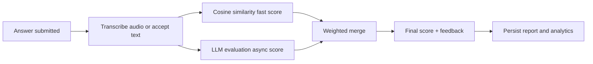

<div align="center">

# ✨ Multimodal AI Interview Simulator

### AI-powered interviews with speech, video, resume intelligence, async scoring, and production-ready fallback orchestration.

[](https://fastapi.tiangolo.com)
[](https://react.dev)
[](LICENSE)

</div>

---

## 💫 About This Project

**Multimodal AI Interview Simulator** is a production-oriented interview platform that turns a resume into a guided interview, captures spoken or typed answers, evaluates responses through a hybrid AI scoring pipeline, and returns structured feedback with analytics.

It is built like a real deployment target, not just a notebook demo:

- 🔭 Resume-aware interview generation with personalized question plans
- 🎙️ Audio answer support through `faster-whisper`
- 🧠 Hybrid scoring with semantic similarity plus LLM evaluation
- 🔁 Multi-provider AI gateway with retry, timeout, and fallback routing
- 🧍 Camera/posture and anti-cheat signals from the browser
- 📊 Analytics, reports, Prometheus metrics, and request tracing
- 🧱 MongoDB-backed interview state machine with refresh-safe recovery
- 🚀 Docker backend for Hugging Face Spaces and Vercel frontend deployment

---

## 🚀 Featured Build

| Layer | What it does |
|---|---|
| **Client / Frontend** | React 19, Vite, TailwindCSS, Firebase Auth, camera/mic capture, real-time interview UI |
| **API Layer** | FastAPI routes for sessions, uploads, scoring, posture, reports, health, metrics, and admin flows |
| **Core Services** | Interview orchestration, ASR, AI gateway, scoring coordinator, feedback generation, analytics |
| **Data Layer** | MongoDB for users, interviews, responses, session state, analytics, and logs |
| **AI Fallback Chain** | Hugging Face Inference API → local GPU inference → template evaluator |
| **Deployment** | Backend on Hugging Face Docker Space, frontend on Vercel |

🔗 **Live Demo:** [https://ascent-intrv.vercel.app](https://ascent-intrv.vercel.app)

---

## 🏗️ System Architecture

<p align="center">
  
</p>

---

## ✨ Key Engineering Features

| Feature | Implementation |
|---|---|
| 📄 **Resume Intelligence** | Parses PDF/DOCX resumes and extracts skills, projects, experience, and role context |
| 🧩 **Interview State Machine** | MongoDB-backed session state with idempotent next-question recovery |
| 🎤 **Speech Pipeline** | `faster-whisper` transcription with CPU-friendly deployment support |
| 🧠 **Split-Lock Scoring** | Fast cosine similarity path plus async LLM evaluation path |
| 🔁 **AI Gateway** | Provider routing, timeout handling, retries, exponential backoff, and template fallback |
| 🛡️ **Anti-Cheat Signals** | Fullscreen checks, tab-switch detection, face/posture events, and violation logging |
| 📈 **Observability** | Request IDs, `/api/health`, `/api/metrics`, Prometheus client, latency/error metrics |
| 🐳 **Cloud-Ready Runtime** | Single-worker Docker backend tuned for Hugging Face Spaces memory limits |

---

## 🧠 AI + Scoring Pipeline



The scoring system is designed to stay useful even when external AI calls fail. The platform tries the best provider first, falls back cleanly, and still returns feedback instead of leaving the candidate stuck.

---

## 🌐 Socials

[](https://www.linkedin.com/in/faais-k/)
[](mailto:faaisbinkasim@gmail.com)

---

## 💻 Tech Stack


---

## ⚡ Quick Start

### 1. Backend

```bash
python -m venv venv
source venv/Scripts/activate
pip install -r requirements.txt
uvicorn backend.app.main:app --host 0.0.0.0 --port 7860 --workers 1
```

API docs will be available at:

```text
http://localhost:7860/docs
```

### 2. Frontend

```bash
cd frontend
npm install
npm run dev
```

Frontend will usually run at:

```text
http://localhost:5173
```

---

## 🔐 Environment Variables

### Backend `.env`

```env
APP_STAGE=development
STORAGE_DIR=storage
MONGODB_URL=mongodb://localhost:27017
MONGODB_DB=ai_interview_sim
HF_TOKEN=hf_your_token_here
HF_API_MODEL=Qwen/Qwen2.5-72B-Instruct
ALLOWED_ORIGINS=http://localhost:5173
FIREBASE_SERVICE_ACCOUNT='{"type":"service_account"}'
```

### Frontend `frontend/.env`

```env
VITE_API_BASE=http://127.0.0.1:7860/api
VITE_ENABLE_AUDIO_INPUT=true
VITE_FIREBASE_API_KEY=your_key
VITE_FIREBASE_AUTH_DOMAIN=your_project.firebaseapp.com
VITE_FIREBASE_PROJECT_ID=your_project_id
VITE_FIREBASE_APP_ID=your_app_id
```

---

## 🚢 Deployment Notes

| Target | Setup |
|---|---|
| **Hugging Face Spaces** | Uses the YAML block at the top of this README plus the root `Dockerfile` |
| **Vercel** | Deploy `frontend/` as a Vite app and set `VITE_API_BASE` to the HF Space backend URL |
| **MongoDB Atlas** | Add `MONGODB_URL` and `MONGODB_DB` for persistent interview/session analytics |
| **Firebase** | Configure frontend Firebase env values and backend service account for auth checks |

For the full deployment guide, see [`docs/DEPLOY_VERCEL_HF_SPACE.md`](docs/DEPLOY_VERCEL_HF_SPACE.md).

---


## 🛡️ License

MIT License. Built for interview practice, applied AI learning, and real-world deployment experiments.
